# ironicbadger/infra

We started at 100% no leaked credentials. Each time a leak has occurred the counter gets decremented by one. Oops.

This repo is the living, breathing source of truth for my self-hosted infrastructure. I run everything in the open because open source matters.

## Architecture

```mermaid
%%{init: {"theme": "base", "themeVariables": {
    "fontFamily": "monospace",
    "primaryColor": "#5a5a5a",
    "primaryTextColor": "#e8e8e8",
    "primaryBorderColor": "#707070",
    "lineColor": "#d4782c",
    "secondaryColor": "#4a4a4a",
    "tertiaryColor": "#3a3a3a",
    "background": "#3a3a3a",
    "mainBkg": "#4a4a4a",
    "secondBkg": "#5a5a5a",
    "textColor": "#e8e8e8"
}, "flowchart": {"curve": "basis"}, "themeCSS": ".edge-pattern-dotted { stroke-width: 2px !important; } .flowchart-link { stroke-width: 2px !important; } .edgeLabel { font-size: 14px; background: #2a2a2a; }"}}%%
flowchart LR
    subgraph home["Home 🇺🇸"]
        direction TB
        c137["c137<br/>media/storage server<br/>zpool: rust (164TB)"]
        ms01["ms01<br/>app Server<br/>Caddy, DNS, Home Assistant"]
    end

    subgraph offsite["Off-site"]
        direction TB
        ktz-cloud["ktz-cloud<br/>VPS 🇺🇸"]
        igloo["igloo - Canada 🇨🇦<br/>zpool: tank (62TB)"]
        snowball["snowball - UK 🇬🇧"]
    end

    c137 -.->|"zrepl via tailscale"| igloo
    c137 -.->|"zrepl via tailscale"| snowball
    c137 <-.->|"zrepl via tailscale"| ktz-cloud
```



## Core Edge Nodes (VIP)

Caddy and AdGuardHome are configured to run using keepalived and a floating VIP.

| Host | IP | Role | Hardware |
|------|-----|------|----------|
| core-pi5 | 10.42.0.5 | Primary | Raspberry Pi 5 |
| core-zima | 10.42.0.6 | Backup | ZimaBlade |
| **VIP** | **10.42.0.53** | Floating | - |

### Services

- **AdGuard Home** - Local DNS resolution (port 53, web UI on 3000)
- **Caddy** - Reverse proxy with automatic TLS
- **Keepalived** - VRRP failover for VIP
- **Chrony** - NTP time synchronization
- **AdGuard Home Sync** - Config replication from primary to backup

### Usage

```bash
just core                 # Run full core playbook
just core --tags caddy    # Run only caddy role
just core --tags network  # Run only network role
just core --tags adguard  # Run only adguard role
```

### Network Backend

The `core-network` role supports two backends configured via `network_backend`:

- `networkd` - systemd-networkd (Debian)
- `networkmanager` - NetworkManager (Raspberry Pi OS)

The role removes dhcpcd packages and writes a static `/etc/resolv.conf`.

## Technologies

- **Ansible** - Configuration management
- **Docker Compose** - Container orchestration (via `docker-compose-generator`)
- **SOPS + age** - Secret encryption
- **Tailscale** - Mesh VPN
- **ZFS + zrepl** - Storage and replication
- **Just** - Task runner

## Roles Philosophy

Roles are sourced three ways:

| Type | Location | Purpose |
|------|----------|---------|
| **Submodules** | `roles/ironicbadger.*` | Reusable roles maintained in separate repos. Pinned to specific commits. |
| **Galaxy** | `requirements.yaml` | Community roles (e.g., `geerlingguy.docker`). Installed via `just reqs`. |
| **Local** | `roles/<name>` | Project-specific roles not useful elsewhere (e.g., `zrepl`, `ktz-server-welcome`). |

## Prerequisites

- Ansible
- SOPS with age keyfile at `~/.config/sops/age/keys.txt`
- SSH access to target hosts

## Usage

```bash
just reqs              # Install galaxy dependencies
just run <host> <tags> # Run playbook on host
just compose <host>    # Deploy docker-compose services
just sops <file>       # Edit encrypted secrets
just sub-update        # Update git submodules
```

## Structure

```
├── run.yaml              # Main playbook
├── hosts.ini             # Inventory
├── justfile              # Task automation
├── group_vars/           # Variables (some SOPS encrypted)
├── roles/                # Ansible roles
└── services/             # Docker Compose configs per host
    └── <hostname>/
        └── <##-category>/
            ├── compose.yaml
            └── config-<app>/
```

Services are organized under `services/<hostname>/<##-category>/`. The `docker-compose-generator` role merges these into a single compose file on deployment.
