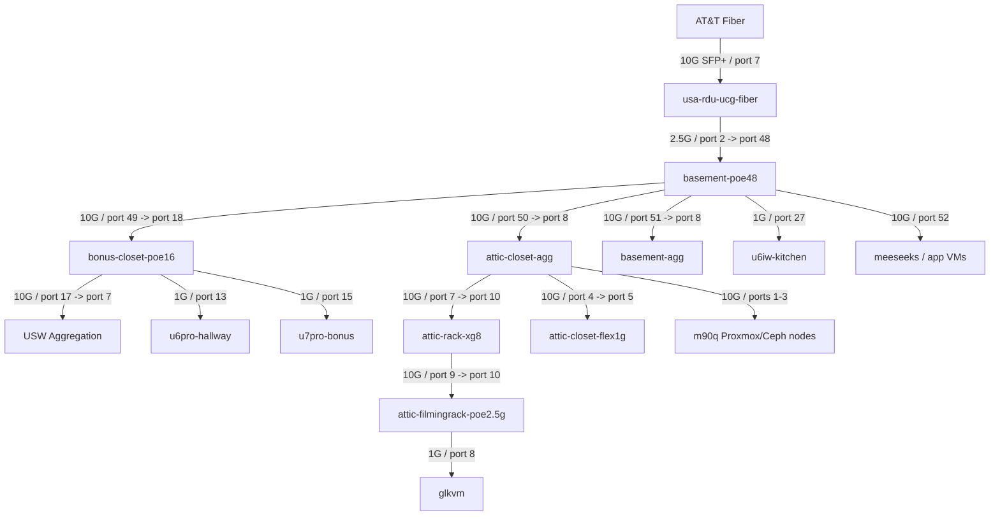

# UniFi Topology Dump

Captured read-only from local UniFi Network at `10.42.0.254`.

Date: 2026-05-04

Site: `default`

Controller / Network version observed: `10.3.58`

Gateway: `usa-rdu-ucg-fiber`

## Current UniFi Networks

These are the currently configured networks, not the final target design.

| Name | Purpose | VLAN | Subnet / Gateway | DHCP Range | Notes |
| --- | --- | ---: | --- | --- | --- |
| `Default` | LAN | native | `10.42.0.254/21` | `10.42.7.1` - `10.42.7.254` | Current main network; most devices are here |
| `tsdev` | LAN | `37` | `192.168.1.254/24` | `192.168.1.100` - `192.168.1.254` | Existing Tailscale/work demo VLAN to preserve |
| `iot-isolated` | LAN | `18` | `10.42.18.1/24` | `10.42.18.6` - `10.42.18.254` | Existing experiment; target plan replaces this |
| `iot-trusted` | LAN | `17` | `10.42.17.1/24` | `10.42.17.6` - `10.42.17.254` | Existing experiment; target plan replaces this |
| `cameras` | LAN | `20` | `10.42.20.1/24` | `10.42.20.6` - `10.42.20.254` | Existing camera VLAN; target plan moves to VLAN/subnet `98` |
| `wd-udm` | Remote user VPN | N/A | `192.168.7.1/24` | N/A | Current UniFi remote-user VPN |
| `AT&T Fiber` | WAN | N/A | N/A | N/A | Enabled WAN |
| `Spectrum` | WAN | N/A | N/A | N/A | Secondary/unused WAN entry |

Current SSIDs:

| SSID | Network |
| --- | --- |
| `ktz` | `Default` |
| `ktz-iot` | `Default` |
| `tsnet` | `tsdev` |

Notable issue: `ktz-iot` currently lands on `Default`, not an IoT VLAN.

## Target Network Reminder

The planned target is:

| Network | VLAN | Subnet |
| --- | ---: | --- |
| Main / Clients | native | `10.42.0.0/24` |
| Core / Services | `10` | `10.42.10.0/24` |
| Trusted | `13` | `10.42.13.0/24` |
| Tailscale demo/work | `37` | keep existing `192.168.1.0/24` |
| IoT | `40` | `10.42.40.0/24` |
| Cameras | `98` | `10.42.98.0/24` |
| Management | `99` | `10.42.99.0/24` |
| Guest | `100` | `10.42.100.0/24` |

## Physical Topology

## Gateway Ports

| Device | Port | Link | Observed Use |
| --- | ---: | --- | --- |
| `usa-rdu-ucg-fiber` | `7` / `ATT` | 10G SFP+ | WAN uplink |
| `usa-rdu-ucg-fiber` | `2` | 2.5G | LAN uplink to `basement-poe48` port `48` |
| `usa-rdu-ucg-fiber` | `5` | 10GE, down | Available/down |
| `usa-rdu-ucg-fiber` | `6` / `SFP+ 1` | SFP+, down | Available/down |

Important implication: the current LAN tree uplinks to the gateway at 2.5G. If the UniFi gateway is the inter-VLAN router, high-volume inter-VLAN traffic can be limited by this path even though most downstream switch links are 10G.

## Switch Uplinks

| Device | Uplink | Speed |
| --- | --- | ---: |
| `basement-poe48` | Port `48` to `usa-rdu-ucg-fiber` port `2` | 2.5G |
| `bonus-closet-poe16` | Port `18` to `basement-poe48` port `49` | 10G |
| `attic-closet-agg` | Port `8` to `basement-poe48` port `50` | 10G |
| `basement-agg` | Port `8` to `basement-poe48` port `51` | 10G |
| `USW Aggregation` | Port `7` to `bonus-closet-poe16` port `17` | 10G |
| `attic-rack-xg8` | Port `10` to `attic-closet-agg` port `7` | 10G |
| `attic-filmingrack-poe2.5g` | Port `10` to `attic-rack-xg8` port `9` | 10G |
| `attic-closet-flex1g` | Port `5` to `attic-closet-agg` port `4` | 1G |
| `u6iw-kitchen` | Port `5` to `basement-poe48` port `27` | 1G |
| `u6pro-hallway` | Port `1` to `bonus-closet-poe16` port `13` | 1G |
| `u7pro-bonus` | Port `1` to `bonus-closet-poe16` port `15` | 1G |

## Important Wired Attachments

### Proxmox / Server Hardware

| Device / Workload | Observed IP | Switch | Port | Speed | Notes |
| --- | --- | --- | ---: | ---: | --- |
| `m90q-1` / `m720q-1` label | `10.42.1.91` | `attic-closet-agg` | `1` | 10G | Proxmox/Ceph node |
| `m90q-2` / `m720q-2` label | `10.42.1.92` | `attic-closet-agg` | `2` | 10G | Proxmox/Ceph node |
| `m90q-3` / `m720q-3` label | `10.42.1.93` | `attic-closet-agg` | `3` | 10G | Proxmox/Ceph node |
| `meeseeks` host / old `win11-gaming` label | `10.42.1.10` | `basement-poe48` | `52` | 10G | Also shows `appnv` and `immich-app` guests on same port |
| `homeassistant` | `10.42.1.99` | `attic-closet-agg` | `1` | 10G | VM behind `m90q-1` |
| `forgejo` | `10.42.1.100` | `attic-closet-agg` | `3` | 10G | Current LXC behind `m90q-3` |
| `panda-proxy` | `10.42.7.146` | `attic-closet-agg` | `2` | 10G | Guest behind `m90q-2` |
| `us-rdu-exit` | `10.42.0.251` | `attic-closet-agg` | `2` | 10G | Guest behind `m90q-2` |

### Core / Admin Devices

| Device | Observed IP | Switch | Port | Speed |
| --- | --- | --- | ---: | ---: |
| `core-pi5` | `10.42.0.53` current VIP/client view | `basement-poe48` | `5` | 1G |
| `core-zima` | `10.42.0.6` | `attic-closet-flex1g` | `3` | 1G |
| `pikvm-megadesk` | `10.42.1.101` | `attic-closet-flex1g` | `4` | 1G |
| `jetkvm-f97bc46bbf5167bc` | `10.42.17.70` | `attic-filmingrack-poe2.5g` | `1` | 100M |
| `glkvm` | `10.42.7.168` | `attic-filmingrack-poe2.5g` | `8` | 1G |

### NVR / Cameras

| Device | Observed IP | Switch | Port | Speed |
| --- | --- | --- | ---: | ---: |
| `nvr` | `10.42.7.121` | `basement-agg` | `7` | 10G |
| `reolink-doorbell` | `10.42.2.13` | `basement-poe48` | `19` | 100M |
| `reolink-deck` | `10.42.2.17` | `basement-poe48` | `21` | 100M |
| `reolink-yard-upper` | `10.42.2.15` | `basement-poe48` | `23` | 100M |
| `reolink-bins` | `10.42.2.14` | `basement-poe48` | `25` | 100M |
| `driveway-left` | `10.42.7.31` | `bonus-closet-poe16` | `10` | 100M |
| `driveway-right` | `10.42.7.9` | `bonus-closet-poe16` | `11` | 100M |

### Tailscale Demo / Work VLAN

| Device / Workload | Observed IP | Switch | Port | VLAN |
| --- | --- | --- | ---: | ---: |
| `framework-desktop` | `192.168.1.13` | `attic-rack-xg8` | `7` | `37` |
| `forgejo` | `192.168.1.198` | `attic-rack-xg8` | `7` | `37` |
| `s3-garage` | `192.168.1.165` | `attic-rack-xg8` | `7` | `37` |
| `forgejo-runner` | `192.168.1.234` | `attic-rack-xg8` | `7` | `37` |

## Design Implications

1. The current physical topology is mostly 10G below the root switch, but the gateway-to-root-switch LAN uplink is 2.5G.

2. Inter-VLAN traffic routed by the UCG-Fiber can hairpin through the 2.5G uplink. This matters most for Plex, backups, file copies, VM migrations, and other high-volume flows.

3. The `m90q-*` Proxmox/Ceph nodes are clustered together on `attic-closet-agg` at 10G, which is good for east/west cluster traffic on the same VLAN.

4. `meeseeks` is on `basement-poe48` port `52` at 10G. Traffic between `meeseeks` and the M90q nodes crosses `basement-poe48` to `attic-closet-agg` over a 10G link.

5. The NVR is on `basement-agg` at 10G, and many cameras are directly attached to `basement-poe48` or `bonus-closet-poe16` at 100M. A camera VLAN migration needs UniFi Protect/NVR reachability planned carefully.

6. The current `ktz-iot` SSID is not actually mapped to an IoT VLAN. It lands on `Default`.

7. Existing IoT experiments use VLANs `17` and `18`; the target plan uses VLAN `40`, so migration should include removing or repurposing the old networks.

8. Current camera VLAN uses VLAN `20`; the target plan uses VLAN `98`, so camera migration should be explicit and staged.

9. The current Proxmox bridge VLAN range on at least `m90q-2` is broad (`2-4094`). Target host config should use a short allow-list such as `10 13 37 40 98 99 100`.

10. If the UCG-Fiber has an available configurable 10G LAN port, moving the LAN uplink from 2.5G to 10G would materially reduce concern about inter-VLAN routing bottlenecks. If not, avoid placing high-volume traffic across VLANs through the gateway.

## Migration Notes

- Do not migrate all networks at once.
- Start with read-only confirmation in UniFi UI/API.
- Preserve the existing `tsdev` VLAN `37`.
- Create target networks before moving clients.
- Move infrastructure/admin interfaces last or with a clear rollback path.
- For cameras, verify NVR adoption/recording behavior before and after each batch.
- For IoT, create the VLAN and SSID mapping first, then move a small number of devices.
- For Main/Trusted split, keep high-volume Plex/media paths in mind before enforcing strict inter-VLAN rules.
